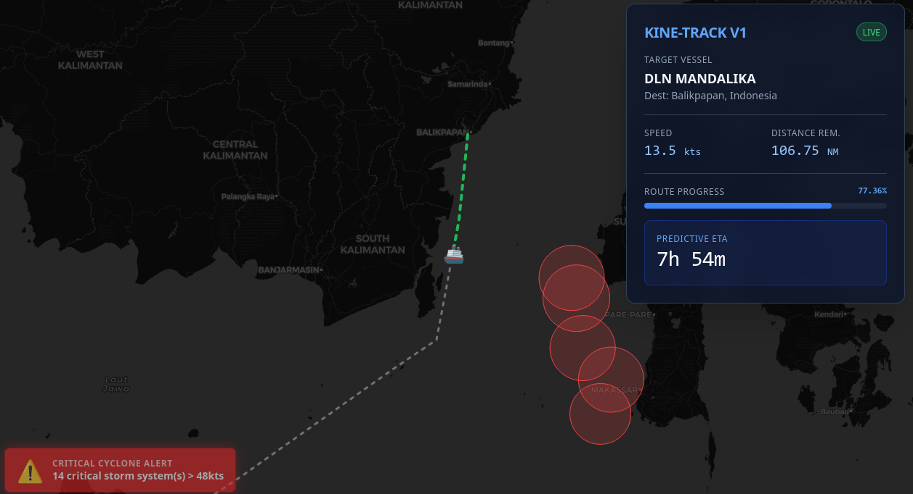

# Kine-Track Spatial Engine 🚢

A high-performance, real-time spatial intelligence engine built in Go and backed by PostGIS. 

This project demonstrates how to handle complex maritime logistics data, including kinematic anti-spoofing, bi-directional trajectory predictions, and severe weather exposure analysis.



## Core Capabilities

1. **Kinematic Anti-Spoofing:** Validates incoming telemetry using Haversine physics. Drops payloads reporting impossible speeds (>45 knots).
2. **Predictive Trajectory (PostGIS):** Uses advanced linear referencing (`ST_LineLocatePoint` & `ST_LineSubstring`) to dynamically slice route geometries and calculate ETA based on directional headings.
3. **Cyclone Scanner:** Real-time spatial intersection testing against active tropical depression polygons to alert vessels entering danger zones.

## Architecture

* **Backend:** Go (Gin Framework, GORM)
* **Database:** PostgreSQL + PostGIS (Dockerized)
* **Frontend:** Vanilla JS + Leaflet.js + TailwindCSS

## Quick Start (Run Locally)

The repository includes a high-fidelity snapshot of real-world routes and cyclone telemetry in the Makassar Strait.

1. Clone the repo and configure your environment:
   ```bash
   git clone https://github.com/adijunek/kine-track-go.git
   cd kine-track-go
   cp .env.example .env
2. Boot the Spatial Database (Automatically imports sample data):
   ```bash 
   docker-compose up -d
3. Run the Engine:
   ```bash 
   go run cmd/server/main.go
4. View the interactive dashboard at http://localhost:8010
